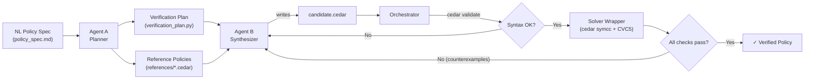

# Cedar Synthesis Engine — Architecture & Workflow

An automated policy synthesis + formal verification harness for [Cedar](https://www.cedarpolicy.com/) access control policies. An AI agent writes a candidate policy, the engine verifies it against formal specs using an SMT solver (CVC5), and the agent iterates on failures until the policy is proven correct.

## Architecture



### Engine Layer (root)

| File                  | Role                                                                                                                                                      |
| --------------------- | --------------------------------------------------------------------------------------------------------------------------------------------------------- |
| `orchestrator.py`   | Evaluator entry point. Runs Gate 1 (syntax via `cedar validate`) then Gate 2 (verification plan checks via `cedar symcc`). Prints loss count.         |
| `solver_wrapper.py` | CVC5/Cedar CLI interface. Wraps three `cedar symcc` subcommands: `implies`, `always-denies`, `never-errors`. Returns `CheckResult` dataclasses. |
| `program.md`        | Agent instructions. Two-phase protocol for the AI coding agent.                                                                                           |

### Workspace Layer (`workspace/`)

| File                     | Role                                                   |
| ------------------------ | ------------------------------------------------------ |
| `schema.cedarschema`   | Cedar schema — entity types, attributes, and actions. |
| `policy_spec.md`       | Natural language access control requirements.          |
| `verification_plan.py` | Formal check definitions (generated by Agent A).       |
| `policy_store.cedar`   | Pre-existing organizational policies.                  |
| `references/*.cedar`   | Ceiling/reference policies for `implies` checks.     |
| `candidate.cedar`      | **Agent output** — the policy under synthesis.  |

### Three Verification Check Types

| Check              | `cedar symcc` subcommand                                | What it proves                                                |
| ------------------ | --------------------------------------------------------- | ------------------------------------------------------------- |
| **Safety**   | `implies --policies1 <candidate> --policies2 <ceiling>` | Candidate ≤ ceiling — never permits more than the reference |
| **Liveness** | `always-denies --policies <candidate>`                  | Policy does NOT trivially deny everything (inverted result)   |
| **Sanity**   | `never-errors --policies <candidate>`                   | No runtime type errors for any possible input                 |

### Entities vs. Domains

In Cedar, **entities** (`entities.json`) define concrete instances for runtime authorization (`cedar authorize`). This engine operates at the **symbolic/type level** using `cedar symcc`, which reasons over all possible inputs — so no `entities.json` is needed.

For bounding string values (e.g., valid departments), `@domain` annotations in the schema give the SMT solver a finite model, serving a similar conceptual role to entities but at the type-constraint level.

---

## Full Workflow

### Phase 0: Setup (Human)

1. **Write the schema** → `workspace/schema.cedarschema`

   - Define entity types, attributes, and actions
   - Optionally add `@domain` annotations to bound string values for the solver
2. **Write the policy spec** → `workspace/policy_spec.md`

   - Natural language rules (safety, liveness, etc.)
3. **Optionally provide existing policies** → `workspace/policy_store.cedar`

### Phase 1: Verification Planning (Agent A — one-time)

Agent A reads the spec + schema and produces the formal test harness:

- `verification_plan.py` — list of check descriptors (`implies`, `always-denies-liveness`, `never-errors`)
- `references/*.cedar` — ceiling policies encoding the maximum permissible scope

🔴 **Human review checkpoint** — verify the plan + references before synthesis.

### Phase 2: Synthesis Loop (Agent B — iterative)

```
                    ┌──────────────────────────────────┐
                    │                                  │
                    ▼                                  │
            ┌──────────────┐                           │
            │   Agent B    │                           │
            │ reads spec,  │                           │
            │ schema, and  │                           │
            │ prior errors │                           │
            └──────┬───────┘                           │
                   │ writes                            │
                   ▼                                   │
         candidate.cedar                               │
                   │                                   │
                   ▼                                   │
  ┌────────────────────────────────┐                   │
  │        ORCHESTRATOR.PY         │                   │
  │                                │                   │
  │  Gate 1: cedar validate        │                   │
  │    → syntax/type errors?       │                   │
  │                                │                   │
  │  Gate 2: cedar symcc + CVC5    │                   │
  │    → implies / always-denies   │                   │
  │      / never-errors            │                   │
  └────────────┬───────────────────┘                   │
               │                                       │
               ▼                                       │
        ┌─────────────┐      Yes                       │
        │ loss == 0 ? │──────────▶ ✅ VERIFIED          │
        └──────┬──────┘                                │
               │ No                                    │
               ▼                                       │
      Counterexamples returned                         │
      to Agent B for fixing                            │
               │                                       │
               └───────────────────────────────────────┘
                    (max 20 iterations)
```

### Example Iteration Trace

**Iteration 1** — Agent writes a naive policy:

```cedar
permit (principal, action == Action::"delete", resource);
```

**Result:** `loss: 1` — implies check fails.

```
COUNTEREXAMPLE: principal.department = "HR", resource.is_locked = false → ALLOW
```

**Iteration 2** — Agent adds department constraint:

```cedar
permit (principal, action == Action::"delete", resource)
when { principal.department == "Engineering" };
```

**Result:** `loss: 1` — still fails.

```
COUNTEREXAMPLE: resource.is_locked = true → ALLOW
```

**Iteration 3** — Agent adds lock guard:

```cedar
permit (principal, action == Action::"delete", resource)
when { principal.department == "Engineering" && !resource.is_locked };
```

**Result:** `loss: 0` — **all checks pass ✓**. Policy is formally verified.

---

## External Dependencies

- **Cedar CLI v4.10+** — `cargo install cedar-policy-cli`
- **CVC5 SMT solver** — at `~/.local/bin/cvc5` (or `$CVC5` env var)
- **Python 3.11+** — no pip dependencies

## Running

CVC5=~/.local/bin/cvc5 python orchestrator.py


## The reference policies *are* the security contract

In a real deployment, the reference policies (ceilings + floors) are the **formal spec** — they encode what the organization *intends* to allow. That's precisely the kind of thing a security team would sign off on, just like they review IAM policy boundaries today. The difference is these are *machine-verifiable*, not just documented in a wiki somewhere.

## The NL translation layer is a natural extension

And your instinct about the NL layer is spot on — it would slot in cleanly:

```
Security Admin (NL)
     ↕  ← LLM translation layer
Reference Policies (Cedar)
     ↓
Verification Engine (SMT)
     ↕  ← counterexample feedback
Agent B (policy synthesis)
```

The translation works in both directions:

1. **Ceiling → NL**: "This reference policy says: *View access is allowed only when the user is a Clinical Researcher with clearance above 3, the document is not Highly Restricted, the project is Active, and either the departments match or the user is a Global Auditor.*"
2. **Admin feedback → Updated ceiling**: Admin says "Actually, I want clearance level 5 for confidential documents specifically" → LLM updates the ceiling policy → engine re-verifies the candidate.
3. **Counterexample → NL**: Instead of showing raw entity graphs, translate them: *"A user in HR with clearance 3 was able to edit an Active project document — is this intended?"*

This closes the loop on the **Verifiable Synthesis Paradox** from our previous research. The paradox was: LLMs generate convincing explanations but incorrect policies. This architecture inverts that:

- The **LLM** writes the policy (where it's unreliable) → but the **SMT solver** catches errors
- The **LLM** translates formal specs to NL (where it's reliable) → so humans can audit the *ground truth*
- The security admin never needs to read Cedar — they review NL summaries of *formally verified* specs

The LLM is used where it's strong (NL ↔ NL translation, code generation with feedback) and the formal methods handle what it's weak at (correctness guarantees). That's a much cleaner division of labor than either pure LLM synthesis or pure manual policy writing.

Would you want to actually build that translation layer into the engine?
